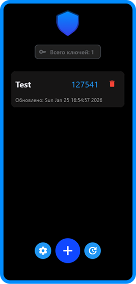
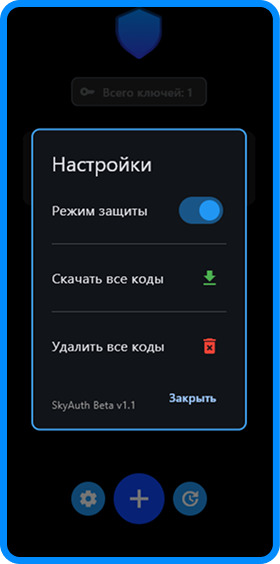
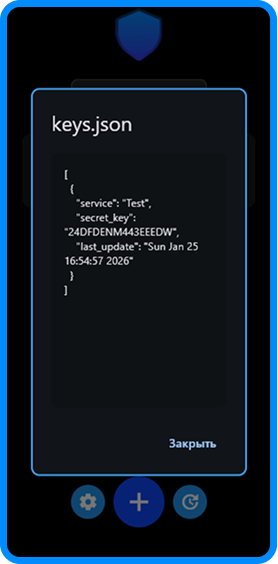
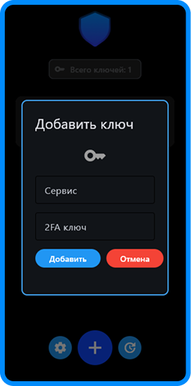

<div align="center">

  
  
  <h1>SkyAuth <span style="color:#2485F4">Beta</span></h1>

  <p><strong>Простое Android приложение для генерации OTP-кодов (2FA)</strong><br>
  Аналог Google Authenticator, который работает <strong>без интернета</strong> и не требует регистрации.</p>

  <br>

  
  
  

  <br><br>

  **Все ключи хранятся только на вашем устройстве. Никакой регистрации, рекламы и слежки.**

</div>

---

### ✨ Основные возможности

- Офлайн-режим (работает без интернета)
- Поддержка TOTP (стандарт 2FA)
- Простой и красивый интерфейс


---

### Скриншоты проекта

<p align="center">
  
  
  
  
</p>

---

## Как запустить?

### Windows 💻
 
Распакуйте архив и запустите `main.py`

Виртуальное пространство (.venv)
```python
.venv\Scripts\activate.bat
```

### Android 📱

**Способ 1:**  
Установите `skyauth.apk`

**Способ 2 (через Flet):**  
```python
flet build apk
```
## Стуктура проекта
📁 Korand-py
├── 📁 assets/               # Папка с ресурсами проекта
├── 📄 LICENSE.md            # Лицензия
├── 📄 README.md             # Описание проекта и инструкция
├── 📄 keys.json             # Файл с 2FA ключами
├── 🐍 main.py               # Основной скрипт проекта
├── 📄 pyproject.toml        # Конфигурация проекта
├── 📄 readme.md             # Дополнительный README (если нужен)
└── 📄 requirements.txt      # Зависимости проекта (pip)


## Лицензия

Проект распространяется под **SlySquad Non-Commercial License v1.0**.

Коммерческое использование **запрещено**.  
Подробности — в файле [LICENSE](LICENSE.md).
